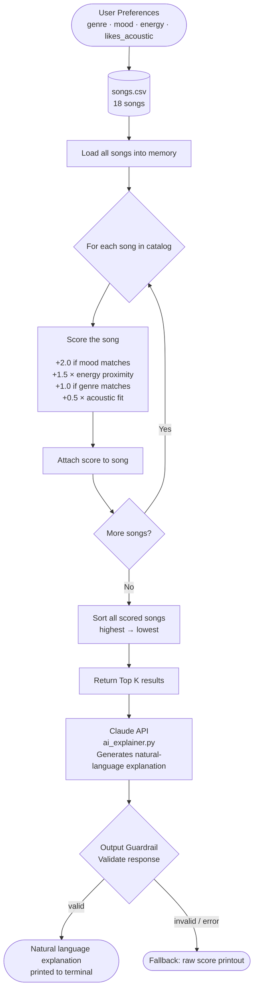
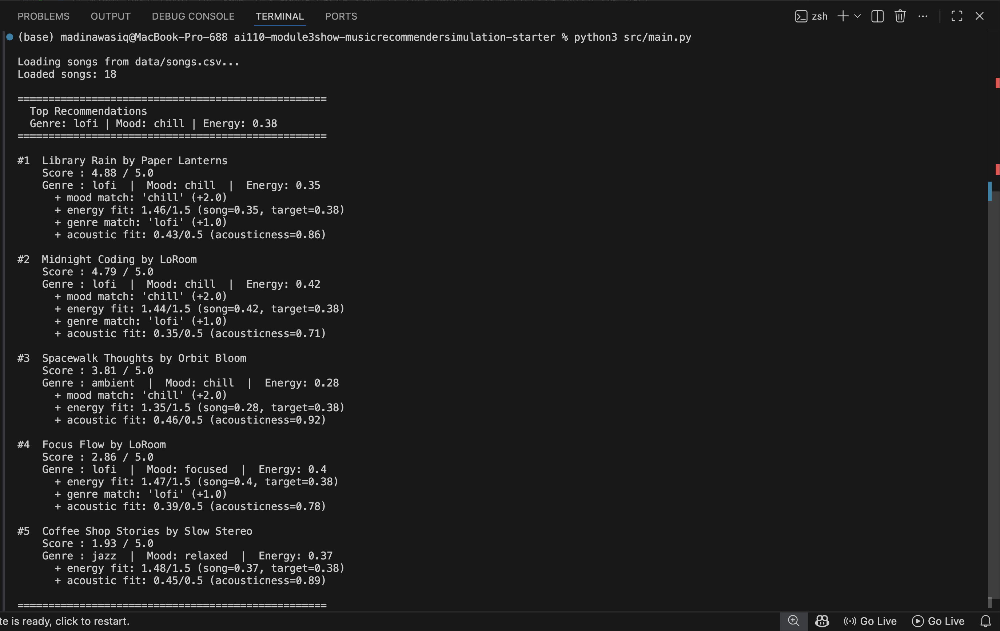
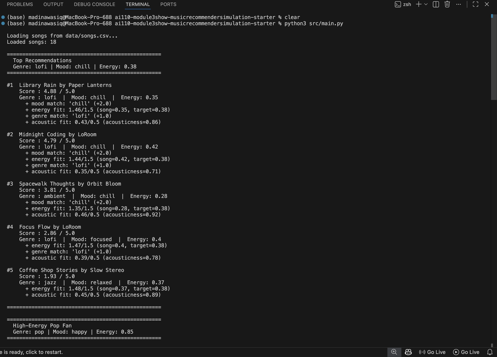
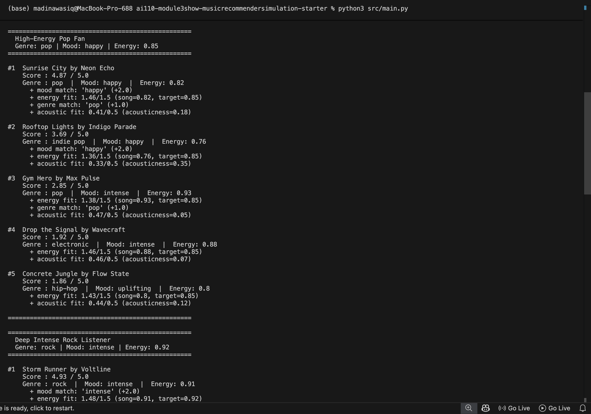
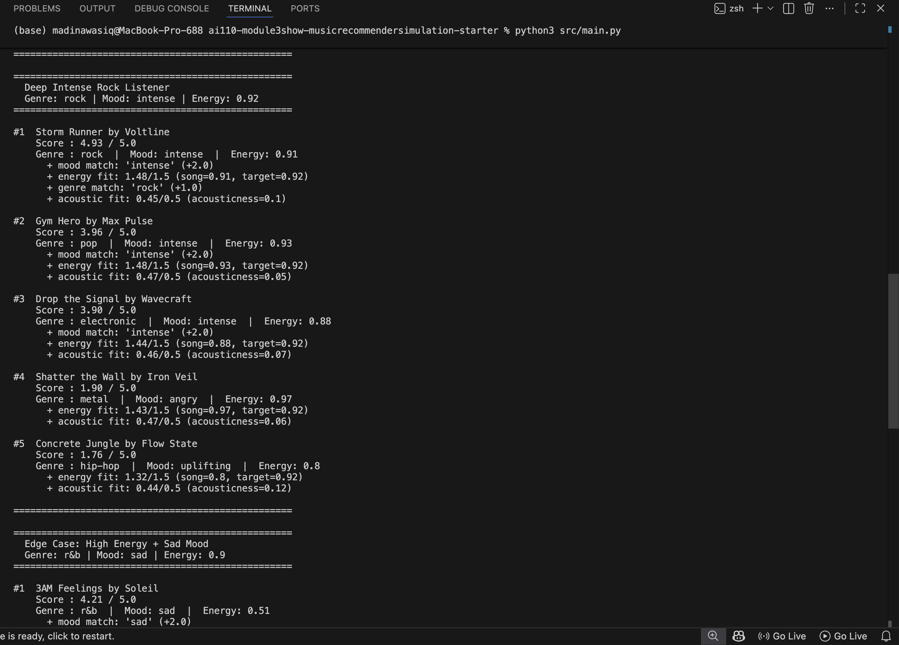
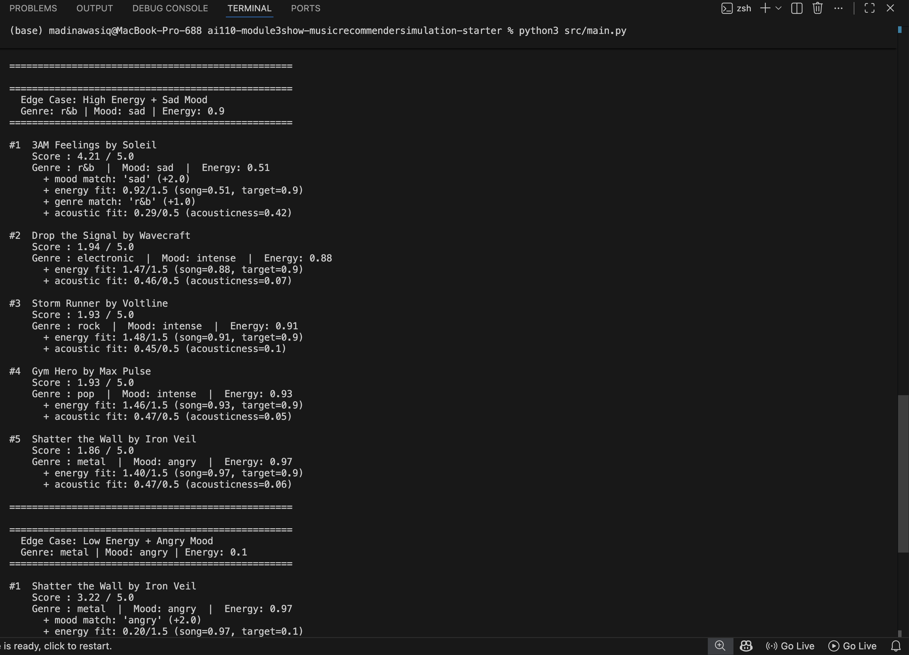
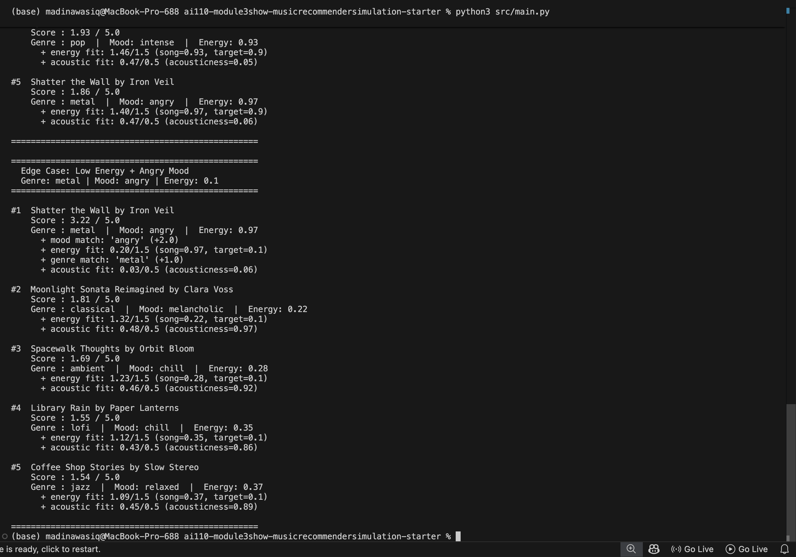

# AI Music Recommender

## Project Summary

**Original project:** This builds on the Music Recommender Simulation project ([original repo](https://github.com/wasiqmadina/ai110-module3show-musicrecommendersimulation-starter)). The original version scored songs against a user profile using a weighted formula and returned ranked recommendations from an 18-song catalog. There was no AI in it, just math.

**This version** adds an AI explanation layer on top of that same scoring system. After the algorithm picks the top songs, it sends the results to the Groq API (Llama 3) which writes a plain English explanation of why each song was recommended. I also added a guardrail that checks the AI response before showing it, and a test harness that runs all five user profiles and shows pass/fail for each one.

---

## Demo Walkthrough

[Watch the video walkthrough on Loom](https://www.loom.com/share/0f47e715677048e48ac960d2ac3c7021)

---

## How The System Works

Real recommenders like Spotify use a mix of collaborative filtering (what do similar users listen to?) and content-based filtering (what does this song actually sound like?). My version only does content-based filtering, it takes the user's preferences and gives every song a score based on how closely it matches.

Each `Song` has these features: id, title, artist, genre, mood, energy, tempo_bpm, valence, danceability, and acousticness. The ones actually used for scoring are genre, mood, energy, and acousticness. Valence, tempo, and danceability are stored but not part of the score yet, they could be added later to make it more precise.

The `UserProfile` keeps track of four things: what genre the user likes, what mood they're looking for, what energy level they want (a number from 0 to 1), and whether they prefer acoustic or electronic-sounding music.

The scoring works like this, each song gets a score in four categories and they're added up with different weights:
- mood match is worth 35% — if the song's mood matches what the user wants, full points, otherwise zero
- energy fit is worth 30% — calculated as `1.0 - |song.energy - user.target_energy|` so closer is always better
- genre match is worth 20% — same as mood, either it matches or it doesn't
- acoustic fit is worth 15% — rewards high acousticness if the user likes acoustic, low acousticness if not

To pick recommendations, every song gets scored and then sorted from highest to lowest. The top k songs (default 5) get returned.

Once the top 5 are picked, the results get sent to the Groq API in `src/ai_explainer.py` which uses Llama 3 to write a plain English explanation of why each song was recommended. Before that gets printed there's a guardrail that checks if the response actually looks valid — if not it just shows the raw scores instead so the user still gets something.

### Algorithm Recipe

Here's the finalized scoring formula. Each song gets a score out of 6.0 total:

- mood match → +2.0 points (binary, either the mood matches or it doesn't)
- energy fit → up to +3.0 points, calculated as `3.0 × (1 - |song.energy - user.energy|)` so songs closer to the user's target energy get more points
- genre match → +0.5 points (also binary)
- acoustic fit → up to +0.5 points, rewards high acousticness if the user likes acoustic sound, or low acousticness if they prefer electronic

I originally had energy at 1.5 and genre at 1.0 but changed the weights during experimentation after finding that mood was overpowering energy too much. A song with completely the wrong energy was still ranking first just because it matched the mood label. Doubling energy and halving genre fixed that for most profiles.

### Potential Biases

Some things I think might go wrong with this system:

- It might over-favor the same 2-3 songs every time if they happen to perfectly match the user profile. There's no way to add variety right now, so the top results could get repetitive.
- The mood matching is all-or-nothing which feels too strict. "Relaxed" and "chill" are basically the same thing but the system treats them as completely different, which means good songs probably get penalized just because of how the mood label was written.
- Genre can also block good recommendations. A great ambient or folk track might match the user's energy and mood perfectly but still score lower than a mediocre lofi track just because of the genre label. That doesn't feel right.
- The acoustic fit is always included in the score even if the user doesn't really have a strong preference either way. It could be pushing down songs the user would actually enjoy.

### Data Flow Diagram



### Terminal Output — Top 5 Recommendations (Chill Lofi Profile)



### Terminal Output — All Profiles







**Profile comparisons:**

- Chill Lofi vs High-Energy Pop: completely opposite results with no overlap — lofi profile surfaces slow acoustic songs under 0.45 energy while pop profile returns loud electronic songs above 0.80 energy. Shows the system correctly separates users at opposite ends of the spectrum.
- High-Energy Pop vs Deep Intense Rock: both want high energy but different moods (happy vs intense) so the results diverge. Sunrise City wins for pop because it's happy + pop, Storm Runner wins for rock because it's intense + rock. Gym Hero shows up in both because it has high energy and is tagged "intense", demonstrates that mood matters more than genre when they conflict.
- Normal profiles vs Edge Cases: the three normal profiles give consistent, logical results. The edge cases expose where the system breaks down — when preferences conflict (high energy + sad mood) or when a mood only has one song in the catalog, the system can't give good recommendations no matter how well the algorithm is tuned.
---

## Getting Started

### Setup

1. Create a virtual environment (optional but recommended):

   ```bash
   python -m venv .venv
   source .venv/bin/activate      # Mac or Linux
   .venv\Scripts\activate         # Windows

2. Install dependencies

```bash
pip install -r requirements.txt
```

3. Add your Groq API key (free at console.groq.com)

```bash
cp .env.example .env
```

Open `.env` and replace the placeholder with your key:
```
GROQ_API_KEY=your-key-here
```

4. Run the app:

```bash
python -m src.main
```

### Running Tests

```bash
pytest                        # unit tests
python -m tests.test_harness  # full pipeline pass/fail for all 5 profiles
```

---

## Sample Interactions

Each run processes all five hardcoded profiles. Below are three examples of real AI output from the system.

**Profile: Chill Lofi Listener** — `genre: lofi | mood: chill | energy: 0.38 | likes_acoustic: True`
```
Based on your taste profile, here's why each recommended song caught our attention:

1. "Library Rain" by Paper Lanterns - This song was highly recommended because it perfectly
matches your lofi preferences with its chill mood and low energy level of 0.35, creating a
peaceful atmosphere. The song's acousticness of 0.86 also aligns with your love for acoustic music.

2. "Midnight Coding" by LoRoom - This song was also a top choice due to its lofi genre and
chill mood, which fits your taste perfectly. Although its energy level is slightly higher than
"Library Rain," at 0.42, it's still within your comfort zone.

3. "Spacewalk Thoughts" by Orbit Bloom - This ambient song has a chill mood and low energy
level, making it an excellent match for your profile. The song's high acousticness of 0.92
also caters to your love for acoustic music, creating a soothing atmosphere.
```

**Profile: High-Energy Pop Fan** — `genre: pop | mood: happy | energy: 0.85 | likes_acoustic: False`
```
Based on your pop-loving, happy, and energetic taste, I'd love to break down each of these
song recommendations for you:

1. "Sunrise City" by Neon Echo - This upbeat pop track is a great fit for you, with a happy
mood and energy level that matches your preferences. The slightly acoustic touch adds a nice
depth to the song without sacrificing the energetic vibe.

2. "Rooftop Lights" by Indigo Parade - This indie pop song shares your love for happy vibes
and a moderate energy level, making it a great match. The song's acoustic elements also give
it a warm, organic feel that should appeal to you.

3. "Gym Hero" by Max Pulse - Although "Gym Hero" has a more intense mood than you typically
prefer, its extremely high energy level might still appeal to you. However, its minimalist,
almost completely synthesized sound might not be the perfect fit for your taste.
```

**Profile: Edge Case — High Energy + Sad Mood** — `genre: r&b | mood: sad | energy: 0.90 | likes_acoustic: False`
```
1. "3AM Feelings" by Soleil - This song topped the list because it perfectly matches your
love for R&B and the sad mood you're in. Its low energy level of 0.51 is still above your
threshold, and while it's relatively acoustic, it's not so much that it detracts from the R&B vibe.

2. "Storm Runner" by Voltline - This song has a high energy level that's close to what you
like (0.91), but it's a rock genre, which is a departure from your R&B preference.

3. "Shatter the Wall" by Iron Veil - This metal song's angry mood and high energy level of
0.97 are the exact opposite of what you're looking for in terms of mood. Its low acousticness
is a plus, but unfortunately the genre and mood are not a good match for you.
```

---

## Design Decisions

**Why keep hardcoded profiles instead of free-text input?** I thought about letting users type what they want but that would need another AI call just to turn the text into structured preferences, and that adds more ways for things to break. The scoring already works well with structured input so I kept it simple.

**Why use the AI for explanation and not scoring?** The scoring formula is transparent, you can see exactly why each song ranked where it did. If I replaced that with an AI it would just be a black box and I wouldn't be able to explain what happened. So I kept the algorithm doing the ranking and just used the AI to write the explanation in plain English.

**Why add a guardrail with fallback?** Because the first test run proved I needed it. The model name was wrong and every single profile errored out. Without the fallback the whole program would have just crashed or printed nothing. The guardrail means the user always gets something even when the API fails.

---

## Testing Summary

The test harness (`tests/test_harness.py`) runs all 5 profiles through the full pipeline and checks 4 things per profile: correct number of results, valid score range, results sorted by score, and a non-empty AI explanation.

**Results: 5/5 profiles passed.**

The first run failed entirely because the Groq model name (`llama3-8b-8192`) was decommissioned — the guardrail caught this and fell back to raw scores for every profile. After updating the model to `llama-3.1-8b-instant` all profiles passed. During the passing run, profiles 3–5 hit Groq's free-tier rate limit (429 errors) but the SDK retried automatically and recovered without any code changes. The guardrail was also tested manually by temporarily passing an empty string — it correctly routed to the fallback output instead of printing nothing.

**Example of guardrail fallback triggering** (what the user sees when the API is unavailable):
```
(AI explanation unavailable — showing raw scores)

#1  Library Rain by Paper Lanterns
    Score: 5.84/6.0
    + mood match: 'chill' (+2.0)
    + energy fit: 2.91/3.0 (song=0.35, target=0.38)
    + genre match: 'lofi' (+0.5)
    + acoustic fit: 0.43/0.5 (acousticness=0.86)

#2  Midnight Coding by LoRoom
    Score: 5.73/6.0
    + mood match: 'chill' (+2.0)
    + energy fit: 2.88/3.0 (song=0.42, target=0.38)
    + genre match: 'lofi' (+0.5)
    + acoustic fit: 0.35/0.5 (acousticness=0.71)
```
The user still gets useful output instead of a crash or a blank screen.

---

## Experiments You Tried

The main experiment I ran was doubling the energy weight from 1.5 to 3.0 and halving the genre weight from 1.0 to 0.5. The max score changed from 5.0 to 6.0. For normal profiles like chill lofi and intense rock, the top results stayed the same — Library Rain and Storm Runner still ranked first. The biggest change was in the edge cases. For the low energy plus angry profile, Shatter the Wall dropped from #1 to #3 because the energy penalty became too large to overcome with just a mood and genre match. Calm songs like Moonlight Sonata and Spacewalk Thoughts moved up because their energy was closer to the target of 0.1. For the sad plus high-energy profile nothing changed because there was still only one sad song in the catalog. That showed me the energy weight shift helped in one case but couldn't fix a problem that was really about missing data.

I also tested five different user profiles including two adversarial edge cases to stress test the system. The chill lofi, pop, and rock profiles all gave results that matched my intuition. The edge cases revealed that conflicting preferences like wanting sad music at high energy produce unreliable results because the catalog can't satisfy both signals at once.

---

## Limitations and Risks

- It only works on 18 songs so results are very repetitive and certain moods only have one song representing them
- Mood matching is binary so similar moods like chill and relaxed are treated as completely different
- It does not understand lyrics, language, tempo patterns, or anything about how the music actually sounds — just the labels assigned to it
- Lofi users get better differentiated results than users of genres with only one song in the catalog, which is an unfair advantage built into the data
- There is no diversity mechanism so the same songs and even the same artist can appear multiple times in the top 5

---

## Responsible AI

**What are the limitations or biases in your system?**
A big one is that mood matching is all or nothing. So like if a song is labeled "relaxed" and the user wants "chill" the system treats those as completely different even though they basically mean the same thing. That felt wrong when I tested it. Also the catalog is only 18 songs and some moods only have one song in it so the algorithm doesn't really have options for those profiles no matter what. Another thing I noticed is that the AI explanation can sound really confident even when the recommendations are bad. For the edge cases the output reads like the system is doing a good job but it's actually just picking the least bad option from a small pool.

**Could your AI be misused, and how would you prevent that?**
For music recommendations probably not that serious but the pattern of using an algorithm to rank things and then having an LLM explain it in a convincing way is used in bigger things like hiring or loan decisions. In those cases if the algorithm is biased the LLM explanation could make an unfair decision sound totally reasonable and the person reading it wouldn't know. I think the way to prevent that is to always show the actual scores and reasons behind the scenes, not just the AI's summary. That's why I kept the fallback output that shows the raw scores. At least then someone can see what actually happened.

**What surprised you while testing?**
Honestly I was surprised when the first test run completely failed because the model name I used (`llama3-8b-8192`) was decommissioned by Groq. I didn't know models could just stop working like that. The whole system errored out and fell back to raw scores for every single profile. I had to look up what the current model name was and swap it out. After that it worked fine but it made me realize you can't just assume the AI service you're using is going to stay the same. Also the rate limiting thing surprised me a little, the test harness hit the free tier limit mid run but the SDK retried automatically so all 5 profiles still passed which was a relief.

**Collaboration with AI**
I used Claude Code as an AI assistant to help me build this. Something that was actually really helpful was when it suggested adding the guardrail with a fallback instead of just crashing if the API fails. I wouldn't have thought to do that on my own, I probably would have just let it error out. That made the system a lot more stable. Something that was wrong was when it gave me the model name `llama3-8b-8192` which turned out to be decommissioned. That broke everything on the first run and I had to go fix it manually. So like even when the AI is helping you build something you still have to double check the details it gives you especially anything about external services.

---

## Reflection

[**Model Card**](model_card.md)

The biggest learning moment for me was realizing that the weights are not just a math decision — they're actually a values decision. When I chose to make mood worth 2.0 points and genre only 0.5, I was saying that how a song makes you feel matters more than what category it belongs to. That seemed obvious to me as a listener but it had real consequences in the output. Songs got rewarded or penalized based on a choice I made, not based on anything inherent in the music itself. That's basically how all recommender systems work, someone decides what matters, bakes it into numbers, and then the algorithm treats those numbers like facts.

The bias part surprised me the most. I expected the bias to come from my scoring formula but a lot of it actually came from the dataset. When the sad plus high-energy profile kept surfacing the wrong song I spent a while adjusting weights before realizing the real problem was that only one sad song existed in the catalog. No algorithm can give good variety when the data doesn't have it. That made me think differently about real platforms,  Spotify's recommendations probably feel better not just because the algorithm is smarter but because they have millions of songs so the formula has real options to choose from. A biased dataset will always produce biased output no matter how carefully you tune the weights.

**If I had more time I would:**
- Expand the catalog to at least 100 songs so edge case profiles have real options to work with
- Replace binary mood matching with similarity scoring so "chill" and "relaxed" are treated as close rather than completely different
- Add a confidence indicator to the AI explanation so it notes when the catalog gap is the real problem, not the algorithm
- Let users type their own preferences instead of using hardcoded profiles


