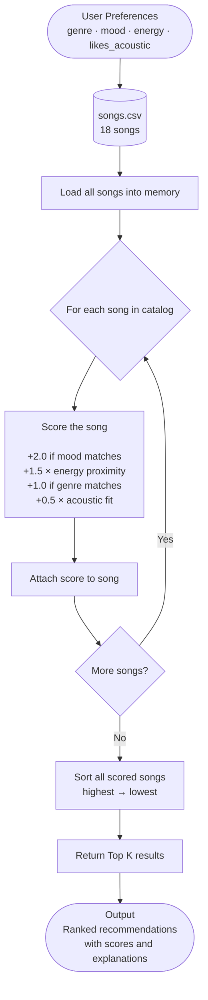

# 🎵 Music Recommender Simulation

## Project Summary

In this project you will build and explain a small music recommender system.

Your goal is to:

- Represent songs and a user "taste profile" as data
- Design a scoring rule that turns that data into recommendations
- Evaluate what your system gets right and wrong
- Reflect on how this mirrors real world AI recommenders

Replace this paragraph with your own summary of what your version does.

This project is a small music recommender that scores songs based on how well they match a user's taste. It uses content-based filtering, which means it looks at the actual attributes of each song (like mood and energy) and compares them to what the user said they want. It doesn't track what other users are doing — it just focuses on the one user's profile. The main thing it prioritizes is getting the emotional vibe right, so mood and energy are weighted the most.

---

## How The System Works

Explain your design in plain language.

Some prompts to answer:

- What features does each `Song` use in your system
  - For example: genre, mood, energy, tempo
- What information does your `UserProfile` store
- How does your `Recommender` compute a score for each song
- How do you choose which songs to recommend

You can include a simple diagram or bullet list if helpful.

Real recommenders like Spotify use a mix of collaborative filtering (what do similar users listen to?) and content-based filtering (what does this song actually sound like?). My version only does content-based filtering, it takes the user's preferences and gives every song a score based on how closely it matches.

Each `Song` has these features: id, title, artist, genre, mood, energy, tempo_bpm, valence, danceability, and acousticness. The ones actually used for scoring are genre, mood, energy, and acousticness. Valence, tempo, and danceability are stored but not part of the score yet, they could be added later to make it more precise.

The `UserProfile` keeps track of four things: what genre the user likes, what mood they're looking for, what energy level they want (a number from 0 to 1), and whether they prefer acoustic or electronic-sounding music.

The scoring works like this, each song gets a score in four categories and they're added up with different weights:
- mood match is worth 35% — if the song's mood matches what the user wants, full points, otherwise zero
- energy fit is worth 30% — calculated as `1.0 - |song.energy - user.target_energy|` so closer is always better
- genre match is worth 20% — same as mood, either it matches or it doesn't
- acoustic fit is worth 15% — rewards high acousticness if the user likes acoustic, low acousticness if not

To pick recommendations, every song gets scored and then sorted from highest to lowest. The top k songs (default 5) get returned.

### Algorithm Recipe

Here's the finalized scoring formula. Each song gets a score out of 6.0 total:

- mood match → +2.0 points (binary, either the mood matches or it doesn't)
- energy fit → up to +3.0 points, calculated as `3.0 × (1 - |song.energy - user.energy|)` so songs closer to the user's target energy get more points
- genre match → +0.5 points (also binary)
- acoustic fit → up to +0.5 points, rewards high acousticness if the user likes acoustic sound, or low acousticness if they prefer electronic

I originally had energy at 1.5 and genre at 1.0 but changed the weights during experimentation after finding that mood was overpowering energy too much. A song with completely the wrong energy was still ranking first just because it matched the mood label. Doubling energy and halving genre fixed that for most profiles.

### Potential Biases

Some things I think might go wrong with this system:

- It might over-favor the same 2-3 songs every time if they happen to perfectly match the user profile. There's no way to add variety right now, so the top results could get repetitive.
- The mood matching is all-or-nothing which feels too strict. "Relaxed" and "chill" are basically the same thing but the system treats them as completely different, which means good songs probably get penalized just because of how the mood label was written.
- Genre can also block good recommendations. A great ambient or folk track might match the user's energy and mood perfectly but still score lower than a mediocre lofi track just because of the genre label. That doesn't feel right.
- The acoustic fit is always included in the score even if the user doesn't really have a strong preference either way. It could be pushing down songs the user would actually enjoy.

### Data Flow Diagram



### Terminal Output — Top 5 Recommendations (Chill Lofi Profile)


### Terminal Output — All Profiles


**Profile comparisons:**

- Chill Lofi vs High-Energy Pop: completely opposite results with no overlap — lofi profile surfaces slow acoustic songs under 0.45 energy while pop profile returns loud electronic songs above 0.80 energy. Shows the system correctly separates users at opposite ends of the spectrum.
- High-Energy Pop vs Deep Intense Rock: both want high energy but different moods (happy vs intense) so the results diverge. Sunrise City wins for pop because it's happy + pop, Storm Runner wins for rock because it's intense + rock. Gym Hero shows up in both because it has high energy and is tagged "intense", demonstrates that mood matters more than genre when they conflict.
- Normal profiles vs Edge Cases: the three normal profiles give consistent, logical results. The edge cases expose where the system breaks down — when preferences conflict (high energy + sad mood) or when a mood only has one song in the catalog, the system can't give good recommendations no matter how well the algorithm is tuned.
---

## Getting Started

### Setup

1. Create a virtual environment (optional but recommended):

   ```bash
   python -m venv .venv
   source .venv/bin/activate      # Mac or Linux
   .venv\Scripts\activate         # Windows

2. Install dependencies

```bash
pip install -r requirements.txt
```

3. Run the app:

```bash
python -m src.main
```

### Running Tests

Run the starter tests with:

```bash
pytest
```

You can add more tests in `tests/test_recommender.py`.

---

## Experiments You Tried

Use this section to document the experiments you ran. For example:

- What happened when you changed the weight on genre from 2.0 to 0.5
- What happened when you added tempo or valence to the score
- How did your system behave for different types of users

The main experiment I ran was doubling the energy weight from 1.5 to 3.0 and halving the genre weight from 1.0 to 0.5. The max score changed from 5.0 to 6.0. For normal profiles like chill lofi and intense rock, the top results stayed the same — Library Rain and Storm Runner still ranked first. The biggest change was in the edge cases. For the low energy plus angry profile, Shatter the Wall dropped from #1 to #3 because the energy penalty became too large to overcome with just a mood and genre match. Calm songs like Moonlight Sonata and Spacewalk Thoughts moved up because their energy was closer to the target of 0.1. For the sad plus high-energy profile nothing changed because there was still only one sad song in the catalog. That showed me the energy weight shift helped in one case but couldn't fix a problem that was really about missing data.

I also tested five different user profiles including two adversarial edge cases to stress test the system. The chill lofi, pop, and rock profiles all gave results that matched my intuition. The edge cases revealed that conflicting preferences like wanting sad music at high energy produce unreliable results because the catalog can't satisfy both signals at once.

---

## Limitations and Risks

Summarize some limitations of your recommender.

Examples:

- It only works on a tiny catalog
- It does not understand lyrics or language
- It might over favor one genre or mood

You will go deeper on this in your model card.

- It only works on 18 songs so results are very repetitive and certain moods only have one song representing them
- Mood matching is binary so similar moods like chill and relaxed are treated as completely different
- It does not understand lyrics, language, tempo patterns, or anything about how the music actually sounds — just the labels assigned to it
- Lofi users get better differentiated results than users of genres with only one song in the catalog, which is an unfair advantage built into the data
- There is no diversity mechanism so the same songs and even the same artist can appear multiple times in the top 5

---

## Reflection

Read and complete `model_card.md`:

[**Model Card**](model_card.md)

Write 1 to 2 paragraphs here about what you learned:

- about how recommenders turn data into predictions
- about where bias or unfairness could show up in systems like this

The biggest learning moment for me was realizing that the weights are not just a math decision — they're actually a values decision. When I chose to make mood worth 2.0 points and genre only 0.5, I was saying that how a song makes you feel matters more than what category it belongs to. That seemed obvious to me as a listener but it had real consequences in the output. Songs got rewarded or penalized based on a choice I made, not based on anything inherent in the music itself. That's basically how all recommender systems work, someone decides what matters, bakes it into numbers, and then the algorithm treats those numbers like facts.

The bias part surprised me the most. I expected the bias to come from my scoring formula but a lot of it actually came from the dataset. When the sad plus high-energy profile kept surfacing the wrong song I spent a while adjusting weights before realizing the real problem was that only one sad song existed in the catalog. No algorithm can give good variety when the data doesn't have it. That made me think differently about real platforms,  Spotify's recommendations probably feel better not just because the algorithm is smarter but because they have millions of songs so the formula has real options to choose from. A biased dataset will always produce biased output no matter how carefully you tune the weights.


---

## 7. `model_card_template.md`

Combines reflection and model card framing from the Module 3 guidance. :contentReference[oaicite:2]{index=2}  

```markdown
# 🎧 Model Card - Music Recommender Simulation

## 1. Model Name

Give your recommender a name, for example:

> VibeFinder 1.0

---

## 2. Intended Use

- What is this system trying to do
- Who is it for

Example:

> This model suggests 3 to 5 songs from a small catalog based on a user's preferred genre, mood, and energy level. It is for classroom exploration only, not for real users.

---

## 3. How It Works (Short Explanation)

Describe your scoring logic in plain language.

- What features of each song does it consider
- What information about the user does it use
- How does it turn those into a number

Try to avoid code in this section, treat it like an explanation to a non programmer.

---

## 4. Data

Describe your dataset.

- How many songs are in `data/songs.csv`
- Did you add or remove any songs
- What kinds of genres or moods are represented
- Whose taste does this data mostly reflect

---

## 5. Strengths

Where does your recommender work well

You can think about:
- Situations where the top results "felt right"
- Particular user profiles it served well
- Simplicity or transparency benefits

---

## 6. Limitations and Bias

Where does your recommender struggle

Some prompts:
- Does it ignore some genres or moods
- Does it treat all users as if they have the same taste shape
- Is it biased toward high energy or one genre by default
- How could this be unfair if used in a real product

---

## 7. Evaluation

How did you check your system

Examples:
- You tried multiple user profiles and wrote down whether the results matched your expectations
- You compared your simulation to what a real app like Spotify or YouTube tends to recommend
- You wrote tests for your scoring logic

You do not need a numeric metric, but if you used one, explain what it measures.

---

## 8. Future Work

If you had more time, how would you improve this recommender

Examples:

- Add support for multiple users and "group vibe" recommendations
- Balance diversity of songs instead of always picking the closest match
- Use more features, like tempo ranges or lyric themes

---

## 9. Personal Reflection

A few sentences about what you learned:

- What surprised you about how your system behaved
- How did building this change how you think about real music recommenders
- Where do you think human judgment still matters, even if the model seems "smart"

