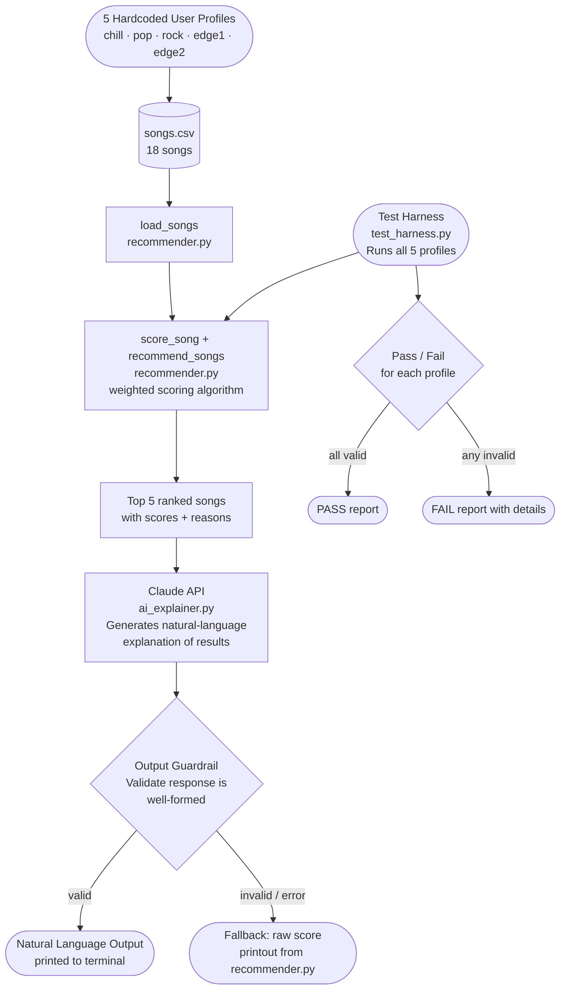

# System Diagram — AI Music Recommender

## Architecture Overview



## Component Descriptions

| Component | File | Role |
|---|---|---|
| User Profiles | `src/main.py` | 5 hardcoded taste profiles used as input |
| Song Catalog | `data/songs.csv` | 18 songs with mood, energy, genre, and acoustic attributes |
| Retriever | `src/recommender.py` | Loads songs and scores each one against the user profile |
| AI Explainer | `src/ai_explainer.py` | Sends ranked results to Claude, returns a natural-language summary |
| Output Guardrail | `src/ai_explainer.py` | Validates Claude's response; falls back to raw output if invalid |
| Test Harness | `tests/test_harness.py` | Runs all 5 profiles end-to-end, prints pass/fail for each |

## Data Flow

```
User Profile
    │
    ▼
load_songs() ──► songs.csv
    │
    ▼
score_song() × 18 songs
    │
    ▼
recommend_songs() ──► Top 5 ranked songs
    │
    ▼
Claude API (ai_explainer.py)
    │
    ▼
Guardrail validation
    ├── valid ──► Natural language explanation (terminal output)
    └── invalid ──► Fallback raw score printout
```